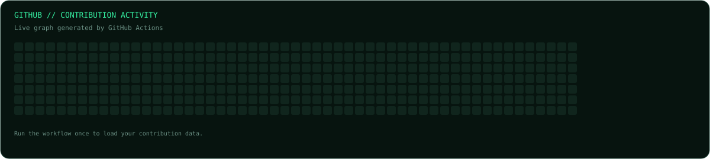

<picture>
  <source media="(prefers-color-scheme: dark)" srcset="./assets/dark_mode.svg">
  
</picture>

 

### `im a developer and i build when i need`

**Original ideas. Thoughtful engineering. Software with purpose.**

[About](#about) &nbsp; / &nbsp; [GitHub Analytics](#github-analytics) &nbsp; / &nbsp; [Languages and Tools](#languages-and-tools) &nbsp; / &nbsp; [Featured Project](#featured-project) &nbsp; / &nbsp; [Snake](#snake) &nbsp; / &nbsp; [Principles](#principles)

## About

I'm **Abhishek Kabiraj**, `@notmekabir`, an aspiring **full-stack custom software developer** with a build-first mindset.

I want to turn ideas into complete products: considered interfaces, dependable backend logic, and the systems that connect them. Before adopting someone else's project, I prefer to build a small version myself and understand what makes it work.

> **Not reinventing everything. Understanding enough to build something of my own.**

## GitHub Analytics

### Contribution Activity

  

### Total Repositories · Stars · Commits

  

  Repository count, stars received, and commit totals are sourced from GitHub-backed statistics.

### Contribution Streak

  

## Languages and Tools

<h3 align="left">Languages and Tools:</h3>

  
  
  
  
  
  
  
  
  
  
  
  
  
  
  
  
  

## Featured Project

  

**ExtensionKill** is a focused browser utility for instantly disabling and restoring Firefox extensions with one click.

## Snake

<!-- Snake Game Repo View -->

  <picture>
    <source media="(prefers-color-scheme: dark)" srcset="./assets/github-snake-dark.svg" />
    <source media="(prefers-color-scheme: light)" srcset="./assets/github-snake.svg" />
    
  </picture>

## Principles

> **Build first. Understand deeply. Refine deliberately.**

**Think independently.** Start with the problem, not someone else's implementation.

**Learn through making.** Build, break, debug, then explain it in your own words.

**Reuse deliberately.** Use established tools when they fit, not because they're fashionable.

**Keep it focused.** Useful, clear, and maintainable beats complicated for its own sake.

---

### `From a blank file to something that matters.`

Follow the build journey on **[@notmekabir](https://github.com/notmekabir)**.

ABHISHEK KABIRAJ &nbsp; / &nbsp; THINK FROM SCRATCH. BUILD WITH INTENT.

